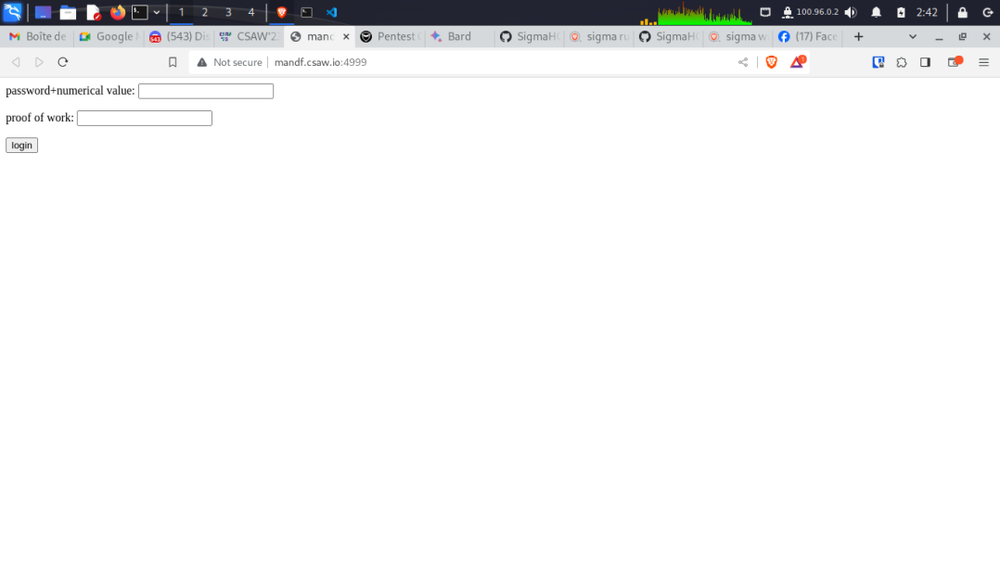

# TITLE

## Description

> A high profile court transcript usually is kept private by the court reporter but this time, there was malware that logged their keystrokes. Can you figure it out for us?
> 
> https://mandf.csaw.io:4999/

## Write-Up

When entering the given website we get:



```html
<form action="/keylogger/" method = "POST">
    <p>password+numerical value: <input type = "text" name = "password" /></p>
    <p>proof of work: <input type = "text" name = "resultant_hash" /></p>
    <p><input type = "submit" value = "login" /></p>
</form>
```

Which means, using the `courtreport.txt` given, we need to get the `password` as well as the `proof of work`.

After some research, we found that the set strings are actually **Steno Strokes**.

To translate the given text, first we run it on a script that makes the identification of the given text with strokes available in different dictionnaries.

As for Plover Stokes, I used this [repository](https://github.com/didoesdigital/steno-dictionaries), as it contains a large set of strokes:words.

```py
import os, json
import pandas as pd

# List all json Plover dict files
path_to_json = 'steno-dictionaries/dictionaries'
json_files = [pos_json for pos_json in os.listdir(path_to_json) if pos_json.endswith('.json')]

# Opening JSON file
lst = []
for i in json_files:
    lst.append(open(f'steno-dictionaries/dictionaries/{i}'))
 
# returns JSON object as a dictionary
data = []
for i in lst:
    data.append(json.load(i))
 

# Open Court file

f = open("courtreport.txt")
courtreport = f.read().split()

# Iterating through the json list
for i in courtreport:
    boolean = False
    for j in data:
        try:
            print(j[i], end=" ")
            boolean = True
            break
        except:
            continue
    if not boolean:
        print(i, end=" ")
 
# Closing file
f.close()
```

Some words required additionnal work, for example words that have `TP-PL` wasn't recognized, where after research and some guessing we found that :

```
"TP-PL": "."
"KW-BG": ","
"-S": "s" //for plurial or abreviation ('s)
"-S/H/A-EU256": "sha256"
"A-EU": "a"
"TPH*EPBT": "internet" // which is actually TPHEPBT
```

(checkout readme file of dictionnaries).

So, we needed to do manual identification.

From there, we get:

```
the declarant expressed satisfaction in the allowance granted by their employer to utilize external keyboards with the company-/EURB/udes laptop.

this privilege facilitated the pursuit of stenographic practice during working hours.

the declarant proceeded to detail the creation of a website, notable for its unique security measure.

instead of conventional password protection, the website's access hinged on the submission of a proof of work.

the password consisted of a word that has a prefix of the number one thousand three hundred thirty-seven.

the password describes a system of modified spellings used primarily on the internet and also goes by ?.

this proof of work entailed the requirement of a password that is ? with a specific numerical value to yield, when subjected to the sha256 cryptographic algorithm, a resultant hash with precisely five leading hexadecimal zeros.
```

From there, we know the following:

```
password : 1337 + word 
proof of work : sha(1337 + word + numerical) = 0000XXXXX....
```

where the word refers to `a system of modified spellings used primarily on the internet and also goes by ?`, which is `leet speak`.

Let's try to see if we can append a numerical value (as suggested in the courtreport), to have the wanted sha256 hash:

using the following code :

```py
from hashlib import sha256

lz = 5
name = '1337speak'
attempts = 1
prefix = '0' * lz

while True:
    if (hash_ := sha256(f'{name}{attempts}'.encode()).hexdigest()).startswith(prefix):
        print(f'Password: {name}{attempts}')
        print(f'Proof of Work: {hash_}\n')
    attempts += 1
```

We get:

```
Password: 1337speak83497
Proof of Work: 0000018d5443869adce6e469f17aa0ee87221eb61d63f2bb8d3a2d91ce7a90fa
```

Now, let's adapt the script to bruteforce possible numerical values and submitting them in the given website:

```py
import requests
from hashlib import sha256

url = 'http://mandf.csaw.io:4999/keylogger/'

# Generate params
lz = 5
attempts = 1
prefix = '0' * lz
name= "1337speak"
while True:
    if (hash_ := sha256(f'{name}{attempts}'.encode()).hexdigest()).startswith(prefix):
        # Replace 'param1' and 'param2' with the actual parameter names you need
        params = {
            'password': f'{name}{attempts}',
            'resultant_hash': hash_
        }

        print(f'Attempt : {name}{attempts}')

        # Send the POST request
        response = requests.post(url, data=params)

        # Print the response
        # print(response.text)

        if "csaw" in response.text:
            print(f'flag found with : {name}{attempts}')
            print(response.text)
            break

    attempts += 1
```

From there, we get:

```
flag found with : 1337speak83497
Proof of Work : 0000018d5443869adce6e469f17aa0ee87221eb61d63f2bb8d3a2d91ce7a90fa

csawctf{itTookThisManyTries}
```

## Flag

csawctf{itTookThisManyTries}

## More Information

- https://gist.github.com/Talljoe/30f436a764528b8491f1d3d66b4d3de3
- https://plover.readthedocs.io/en/latest/dict_formats.html
- https://plover.readthedocs.io/en/latest/api/steno.html
- Plover Translator : https://www.typination.com/ploversteno
- Disctionnaries repository : https://github.com/didoesdigital/steno-dictionaries