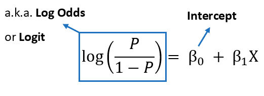

# Sigma's Logistic

## Description

> Wall Street Traders couldn't write a good model! Sigma wrote a new one and says no one can steal it now.
>
> Connect with: nc mandf.csaw.io 3000

## Write-Up

From the previous challenge in CSAW Quals **Linear Agressor**, we dealt with a **Linear Regression Model** that takes inputs, and give us an output.

This time, we will do the same technique, but instead we will be dealing with a **Logistic Regression** model with **Sigmoid Function**.

**Solution:** Furthermore, as we know the equation of logistic regression models :


From there, to go back to **Linear Regression** Like function, we do:



From there, and as we have `30` inputs, we deduce that we have `30` feature `a0...a29` to extract plus the `b` (biais). From there, we can for `30` tries when each time we leave only one feature on and shutfown all others feature. at the end, we shutdown all feature to get the `b` value and substract it from the extracted features. We suspect the flag to be asciis of the features.

Here is the code:

```py
#! /usr/bin/python3


from pwn import *
import math

HOST = 'misc.csaw.io'
PORT = 3000

lst = []

# Extract from a0 to a29
for i in range(0, 30):
    p = remote(HOST, PORT)

    for j in range(30):
        if j == i:
            p.sendlineafter(b'Enter your input: \r\n', b'1')
        else:
            p.sendlineafter(b'Enter your input: \r\n', b'0')
    print(f"Sent {i}!")

    p.recvline()
    lst.append(p.recvline())
    print(lst)
    p.close()


# Extract b
p = remote(HOST, PORT)

for j in range(30):
    p.sendlineafter(b'Enter your input: \r\n', b'0')
print(f"Sent 30!")

p.recvline()
lst.append(p.recvline())
print(lst)
p.close()

# Construct Flag
# lst = [b'1.603810890548638e-28\r\n', b'1.8048513878454153e-35\r\n', b'1.1850648642339812e-27\r\n', b'3.305700626760734e-37\r\n', b'1.603810890548638e-28\r\n', b'6.639677199580733e-36\r\n', b'7.984904245686979e-30\r\n', b'6.054601895401186e-39\r\n', b'8.315280276641321e-07\r\n', b'8.75651076269652e-27\r\n', b'6.639677199580733e-36\r\n', b'1.0806392777072785e-30\r\n', b'2.2603242979035746e-06\r\n', b'2.4426007377405277e-36\r\n', b'2.9374821117108028e-30\r\n', b'1.0806392777072785e-30\r\n', b'2.0611536181902037e-09\r\n', b'8.75651076269652e-27\r\n', b'8.315280276641321e-07\r\n', b'8.75651076269652e-27\r\n', b'3.305700626760734e-37\r\n', b'4.1399375473943306e-08\r\n', b'1.522997951276035e-08\r\n', b'8.75651076269652e-27\r\n', b'1.8048513878454153e-35\r\n', b'8.315280276641321e-07\r\n', b'2.9374821117108028e-30\r\n', b'7.281290178321645e-33\r\n', b'4.1399375473943306e-08\r\n', b'8.194012623990515e-40\r\n', b'0.9999999999999993\r\n']

newlst = [float(l.strip()) for l in lst]
adapt_to_logistic = [math.ceil(math.log(l / (1 - l))) for l in newlst]
flag_chars = [chr(-(c - adapt_to_logistic[-1])) for c in adapt_to_logistic]
flag = ''.join(flag_chars)

print(flag)
```

## Flag

csawctf{1_th0ugh7_1_w45_s1gm4}

## More Information

- https://www.toptal.com/machine-learning/adversarial-machine-learning-tutorial
- https://viso.ai/deep-learning/adversarial-machine-learning/
- http://www.cleverhans.io/2020/04/06/stealing-bert.html
